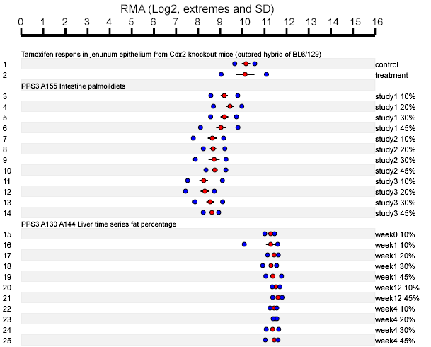

The NuGO *Clean Transcriptome Database* is a module of the [Nutritional Phenotype database](http://dbnp.org/dbnp/modules-1/cleantranscriptomicsdatabase) that allows users to submit their transcriptome data in the raw format (*.CEL files). Along the way the data is processed, normalized and stored. Users are asked to provide an experiment title and are allowed to arrange the individual hybridizations into groups of biological repeats for statistical needs.

A global password is provided making the CTD safe for external access. In addition, laboratory protocols can be uploaded, edited and shared. Programmable access is provided by JSON http requests directly [(protocol)](http://dbnp.org/dbnp/modules-1/detailed-descriptions-of-restful-services). JSON examples with a password are found  on the [example page](http://nbx13.nugo.org/ctd)

The main advantage of the Clean Transcriptome Database is the equal normalization of CEL files using RMA and GRSN (global rank-invariant set normalization, [pubmed](http://www.ncbi.nlm.nih.gov/pmc/articles/PMC2644708/?tool=pubmed). GRSN ensures samples within a dataset are fitted to an average intensitiy distribution allowing for a more robust comparison. However, one should always be aware of the probability of overfitting datasets.
The probeset name can be used to query the database resulting in a graphical representation of all expression values for a specific gene. If samples have been grouped a standard deviation bar is shown.

_Figure 1: Expression values grouped by sample treatment and experiment. The extremes (blue dots), average (red dots) and STD are shown for gene 19013 (mouse: probeset 19013_at)._
